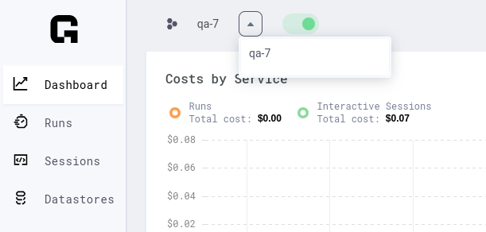

# Create Datastores

Datastores can be created from a number of sources (on both the CLI and UI)

- Uploading files stored on your computer.
- From an HTTP URL which downloads a `.zip` or `.tar.gz` file. These files are
  automatically extracted by the Grid Platform before they are attached to a Run or
  Session
- From a public S3 Bucket using the syntax `s3://bucket-name/path/` 
- (BYOC-users only) From a private S3 bucket using the syntax `s3://bucket-name/path/`

## Uploading Files from a Computer
### Small datasets

You can use the UI to create Datastores for datasets smaller than 1GB (files or folder).
We have noticed that when the Datastore sizes are 1GB+ you start to hit the browser limit
for uploading data. In such situations we advise using the CLI to create Datastores.

Select the file or folder and click upload.


:::note 

You can still use the CLI for these datastores!

:::

### Large datasets (1 GB+)

For datasets larger than 1 GB, use the CLI.


:::note 

If you have a dataset that is 1Gb+, we suggest creating an Interactive Session and
creating the Datastore from there. Internet speed is much faster in Interactive Sessions,
so upload times will be shorter. 

:::

First, install the grid CLI and login

```bash
pip install lightning-grid --upgrade
grid login
```

Next, use the Datastores command to upload any folder:

```bash
grid datastore create ./imagenet_folder/ --name imagenet
```

This method can work from:

* A laptop.
* An interactive session.
* Any machine with an internet connection and Grid installed.
* A Corporate cluster.
* An Academic cluster.

# Creating Datastores from an S3 Bucket

## Create From a Public S3 Bucket

Any public [AWS S3](https://aws.amazon.com/s3/) bucket can be used to create datastores on
the grid public cloud or a BYOC cluster using either the grid CLI or UI. 

### Using the UI

**_TODO: CAPTURE SCREEN RECORDING SHOWING STEPS OF CREATING DATASTORE FROM S3 VIA UI_**

### Using the CLI

In order to use the CLI to create a datastore from an S3 bucket, we simply need to pass a
S3 URL in the form `s3://<bucket-name>/<any-desired-subpaths>/` to the 
[`grid datastore create`](../../../cli.md#create) command. 

For example, to create a datastore from the [`ryft-public-sample-data/esRedditJson`
bucket](https://s3.console.aws.amazon.com/s3/buckets/ryft-public-sample-data?region=us-east-1&prefix=esRedditJson/&showversions=false)
we simply execute:

```bash
grid datastore create s3://ryft-public-sample-data/esRedditJson/
```

Which will copy the files from the source bucket into the managed Grid Datastore storage
system. 

:::tip

In the above example, you'll see that we omitted the `--name` option in the CLI command.
When the `--name` option is omitted, the datastore name is assigned the name of the last
"directory" making up the source path. So in the case above, the datastore would be named
`"esredditjson"` (the name is converted to all lowercase ASCII non-space characters). 

If we we wanted to use a different name, we can override the implicit naming by passing
the `--name` option / value parameter explicitly. As an example, if we wanted to create a
datastore from this bucket named `"lightning-train-data"` we could execute:

```bash
grid datastore create s3://ryft-public-sample-data/esRedditJson/ --name lightning-train-data
```

:::

## Create from a Private S3 Bucket

At this time we are only supporting usage of private S3 buckets as Datastores for BYOC
users, who have connected Grid to a custom AWS cluster. You can grant Grid access to your
desired buckets by following the official aws
[documentation](https://aws.amazon.com/premiumsupport/knowledge-center/cross-account-access-s3/).

As a convenience, below we provided a bucket policy that grants Grid access to all the
contents of your specified bucket. It assumes that you modified the tfvars role_arn field.
If you have not then you can use `<aws-account-id-associated-with-byoc>:root` instead. You
can follow this official aws
[documentation](https://docs.aws.amazon.com/IAM/latest/UserGuide/console_account-alias.html)
to get your account id.

```json
{
    "Version": "2012-10-17",
    "Statement": [
        {
            "Effect": "Allow",
            "Principal": {
                "AWS": "arn:aws:iam::<aws-account-id-associated-with-byoc>:role/role-name"
            },
            "Action": [
                "s3:ListBucket",
                "s3:GetObject",
                "s3:GetBucketLocation"
            ],
            "Resource": [
               "arn:aws:s3:::<your-bucket>/*",
               "arn:aws:s3:::<your-bucket>"
           ]               
        }
    ]
}
```

### Using the UI & CLI

Once appropriate permissions have been assigned to the BYOC cluster, a Datastore can be
created from the appropriate (private) S3 bucket in the same way Datastores are created
from public S3 buckets. The only differences are:

* On the CLI, you must either have your default cluster set to the BYOC cluster of
  interest (see the [`grid user set-default-cluster` CLI
  reference](../../../cli.md#set-default-cluster) for details), or you must must pass 
  the `--cluster` option to the [`grid datastore create` command](../../../cli.md#create) 
  with the appropriate value. For example, to create datastore on the
  `"my-first-byoc-cluster"` cluster:

  ```bash
  grid datastore create s3://my-private-bucket/data/ --cluster my-first-byoc-cluster
  ```

* On the UI, you must ensure that the selected cluster name (as shown in the screenshot
  below in the dropdown at the top left of any main page) is appropriate before clicking
  the "New Datastore" button. 

  


## Create from an HTTP URL

Datastores can be created from a `.zip` or `.tar.gz` file accessible at an unauthenticated
HTTP URL. By using an HTTP URL pointing to an archive file as the source of a Grid
Datastore, the platform will automatically kick off a (server-side) process which
downloads the file, extracts the contents, and sets up a datastore file directory
structure matching the extracted contents of the archive. 

:::info

This mechanism of creating a Datastore is the only one which will implicitly process the
specified files into a different form / structure than they were originally in. By this,
we mean to say that since it's only ever possible to get a single compressed archive file
from a URL, we think it's fair to make the assumption that what you actually want is the
extracted contents of the archive, not the archive file itself. 

Said another way: if you were to upload a `.zip` or `.tar.gz` file from your local
computer, or specify an S3 bucket which contained a single archive, we would NOT extract
this file since it's assumed that you are able to process the data into the structure you
actually need before creating the Datastore. If you sent us a `.zip` file via these
methods, you would get a `.zip` file in the Datastore mount path. 

:::

### Using the UI

**_TODO: CAPTURE SCREEN RECORDING SHOWING STEPS OF CREATING DATASTORE FROM S3 VIA UI_**

### From the CLI

In order to use the CLI to create a datastore from an HTTP URL, we simply need to pass a
URL which begins with either `http://` or `https://` to the [`grid datastore
create`](../../../cli.md#create) command.

For example, to create a datastore from the the MNIST training set at:
`https://datastore-public-bucket-access-test-bucket.s3.amazonaws.com/subfolder/trainingSet.tar.gz`
we simply execute:

```bash
grid datastore create https://datastore-public-bucket-access-test-bucket.s3.amazonaws.com/subfolder/trainingSet.tar.gz
```

Which will copy the files from the source bucket into the managed Grid Datastore storage
system. 

:::tip

In the above example, you'll see that we omitted the `--name` option in the CLI command.
When the `--name` option is omitted, the datastore name is assigned from the last `path`
component of the URL (with suffixes stripped) So in the case above, the datastore would be named
`"trainingset"` (the name is converted to all lowercase ASCII non-space characters). 

If we we wanted to use a different name, we can override the implicit naming by passing
the `--name` option / value parameter explicitly. As an example, if we wanted to create a
datastore from this bucket named `"lightning-train-data"` we could execute:

```bash
grid datastore create https://datastore-public-bucket-access-test-bucket.s3.amazonaws.com/subfolder/trainingSet.tar.gz --name lightning-train-data
```

:::


## Create from a Session
### Upload via Interactive Session

For huge datasets that need processing or a lot of manual work, we recommend this flow:

* launch an Interactive Session
* download the data
* process it
* upload


### Screen

When you are in the interactive Session, use the [terminal multiplexer
`Screen`](https://www.gnu.org/software/screen/manual/screen.html) to make sure you don't
interrupt your upload session if your local machine is shut down or experiences network
interruptions. 

```bash
# start screen (lets you close the tab without killing the process)
screen -S some_name
```

now do whatever processing you need:

```bash
# download, etc...
curl http://a_dataset
unzip a_dataset

# process
do_something
something_else
bash process.sh
...
```

when you're done, upload to Grid via the CLI (on the Interactive Session):

```bash
grid datastore create imagenet_folder --name imagenet
```

:::note 

Grid CLI is auto-installed on sessions and logged in under your credentials. 

:::

## Create from a Cluster

### Upload from a cluster

Use these instructions to upload from:

* Corporate cluster.
* Academic cluster.

First, start screen on the jump node (to run jobs in the background).

```bash
screen -S upload
```

If your jump node allows a memory-intensive process, then skip this step. Otherwise,
request an interactive machine. Here's an example using
[SLURM](https://slurm.schedmd.com/documentation.html).

```bash
srun --qos=batch --mem-per-cpu=10000 --ntasks=4 --time=12:00:00 --pty bash
```

Once the job starts, install and log into Grid (get your username and ssh keys from the
[settings page](https://platform.grid.ai/#/settings)).

```bash
# install
pip install lightning-grid --upgrade

# login
grid login --username YOUR_USERNAME --key YOUR_KEY
```

Next, use the Datastores command to upload any folder:

```bash
grid datastore create ./imagenet_folder/ --name imagenet
```

You can safely close your ssh connection to the cluster (the screen will keep things
running in the background).


