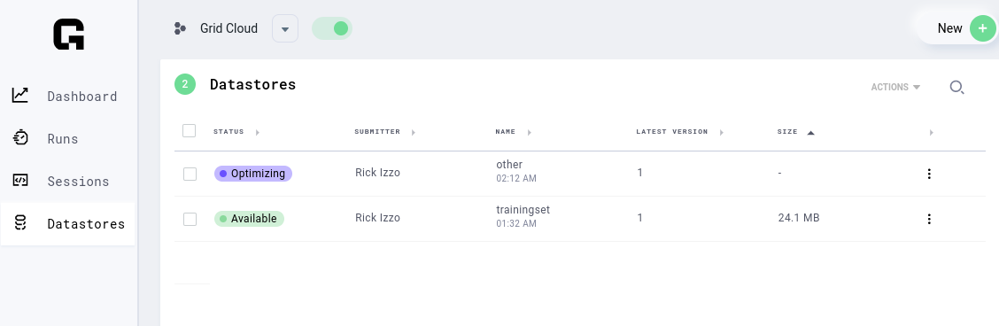

# Viewing Datastore Status

Depending on the source of the data used to create a Datastore, there may be some delay
between the Datastore creation request and the point at which the Datastore is actually available
for use. 

## Processing Times

Processing times follow these general trends for each source type:

* Datastores created from files uploaded on the CLI or UI are generally available within
  seconds after the upload completes.
* Datastores created from HTTP URLS will take a minimum of 30 seconds to process for small
  archive sizes, and will scale linearly as archive size increases (for context, a 80GB
  archive takes between 15-20 minutes to process) 
* Datastores created from S3 buckets are completely dependent on the number of blobs in
  the source bucket and the total size of the datastore. For small datastore sizes,
  (1-30GB), this process generally completes in less than 5 minutes. For larger, yet
  reasonably sized datasets (less than the [current maximum datastore
  size](../faq.md#datastore-size-limit)), this process can take up to half an hour.


## Inspecting Datastore Status Using the CLI

Running the [`grid datastore` command](../../../cli.md#grid-datastore) in the terminal is
the definitive way to view all datastores and their associated status (either `failed`,
`optimizing`, `processing`, or `succeeded`). For example: 

```bash
$ grid datastore                                                        
✔ Loading Datastores in prod-2...
┏━━━━━━┳━━━━━━━━━━━━┳━━━━━━━━━┳━━━━━━━━━━━━┳━━━━━━━━━━━━━━━━━━┳━━━━━━━━━━━━┓
┃ Name ┃ Cluster ID ┃ Version ┃       Size ┃       Created At ┃    Status  ┃
┡━━━━━━╇━━━━━━━━━━━━╇━━━━━━━━━╇━━━━━━━━━━━━╇━━━━━━━━━━━━━━━━━━╇━━━━━━━━━━━━┩
│ foo  │     prod-2 │       1 │ 512000 MiB │ 2022-04-04 20:01 │ succeeded  │
│ foo  │     prod-2 │       2 │    761 MiB │ 2022-04-05 05:07 │ succeeded  │
│ other│     prod-2 │       1 │      0 MiB │ 2022-04-07 02:12 │ optimizing │
└──────┴────────────┴─────────┴────────────┴──────────────────┴────────────┘
```

## Inspecting Status Using the UI

Navigate to the [Grid Platform Datastores Tab](https://platform.grid.ai/#/datastores) in
order to view the current status of your datastores in a graphical format.

