--- 
title: Credentials
sidebar_label: Credentials
---

# Grid Credentials

Credentials are secret values that you can use to securely inject sensitive information into the
Grid platform. Credentials are encrypted in the Grid-backend storage
systems and are only decrypted immediately prior to use.

### Access to Secrets (Teams Users)

Credentials can be created by any Grid user, with a limit of 50
Credentials per account. Only the user who created a credential (the owner) can
delete that credential. All of the user's team members are able to utilize the credential in
their own workflow (for example, while creating a Datastore from a private s3 bucket).

Sensitive credential type values can never be retrieved from Grid via the CLI. However,
the values of non-sensitive credential types (such as `--type s3`) can be viewed by the user
who created the credential and any member of the user's team (for our `teams` tier users.)

### Credential Types

At the moment, the following credential types are supported:

- `s3` (access for datastore creation from a private s3 bucket)

## How to Create an `s3` Credential for Private S3 Access (BYOC users only)


Grid now supports the ability to create Datastores from private AWS s3 buckets by using
the `--no-copy` mode via the CLI. In order to allow Grid to access your private buckets,
you'll need to create an authorized AWS Role using the `grid credential create --type s3`
command (explained in detail below). After creating a role, you can run the
`grid datastore create S3://<private-bucket-name-here> --no-copy` command as usual - no
modifications needed. If any of your registered `s3` credentials can access the s3 bucket
path specified, then Grid will automatically use them when creating the Datastore (and
when using that Datastore in a `run` or `session`).

## Prerequisite: Configure IAM Role in AWS

In order to provide Grid access to a private S3 bucket, you must first set up an AWS IAM Role configured with the appropriate permission policy. This is the absolute minimum permission Grid requires in order to list and retrieve files from an s3 bucket of your choice. The `grid credential create` command will dynamically generate the IAM Role Trust Policy based on the cluster on which you are creating the Datastore. While all users will need to authorize the AWS account ID on which the Grid Platform controlplane runs, [bring-your-own-cloud (`BYOC`) users](./2_Custom%20Cloud%20Credentials/1_byoc.md) will also need to include the AWS account ID on which the `BYOC` cluster runs. 

:::info

Please refer to the AWS documentation on [IAM Role Trust
Policies](https://aws.amazon.com/blogs/security/how-to-use-trust-policies-with-iam-roles/)
and [IAM Role Permission
Policies](https://docs.aws.amazon.com/IAM/latest/UserGuide/access_policies.html) for more
detailed information.

:::


We will illustrate the process of registering an IAM Role with Grid using the following
example:

> I want to run an experiment or session using sensitive data contained in a private s3 bucket. The bucket's name is
> `gridai-demo-bucket` and I would like to create a Datastore from any file
> prefix (folder) in the bucket. 

<div style={{textAlign: 'center'}}>

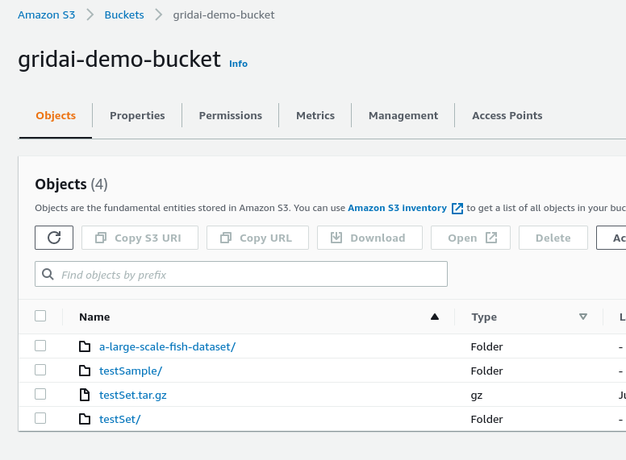

</div>

### 0. Change from deault cluster context
By default the [cluster context](./2_Custom%20Cloud%20Credentials/5_grid-cluster-context.md) is set to `Grid Cloud`. Change this to your BYOC cluster you created. 

```
grid user set-default-cluster <byoc cluster name>
```

### 1. Generate Trust and Permission Policiess

First: run the `grid credential create --type s3` command in order to find the required trust and
permission policies. 

```
$ grid credential create --type s3
Please refer the the the documentation for how to create an AWS role and 
permission policy.

The trust policy for the role should be:
{
  "Version": "2012-10-17",
  "Statement": [
    {
      "Effect": "Allow",
      "Action": "sts:AssumeRole",
      "Principal": {
        "AWS": "302180240179"
      },
      "Condition": {
        "StringEquals": {
          "sts:ExternalId": "6aa0ae3592534df8936b03f4b73294c4"
        }
      }
    }
  ]
}

The permission policy attached to the role should be:
{
  "Version": "2012-10-17",
  "Statement": [
    {
      "Effect": "Allow",
      "Action": [
        "s3:GetBucketLocation",
        "s3:GetObject",
        "s3:ListBucket"
      ],
      "Resource": [
        "arn:aws:s3:::<replace-with-bucket-name>",
        "arn:aws:s3:::<replace-with-bucket-name>/*"
      ]
    }
  ]
}

Please be sure to change the <replace-with-bucket-name> field with the bucket 
name you wish to grant access to. More information can be found on the docs.

Please Note: when creating the role name in the AWS console, the role name MUST 
begin with the prefix: grid-s3-access- any valid characters can follow the 
prefix.

When complete, please enter the role ARN:
```

### 2. Add Trust and Permission Policies to AWS

The `grid credential create` command will output the required trust and permission policies. 

  a. Leave the command prompt open while visiting the [AWS IAM Role
  Console](https://us-east-1.console.aws.amazon.com/iamv2/home?region=us-east-1#/roles) 

  b. Click "Create Role"

  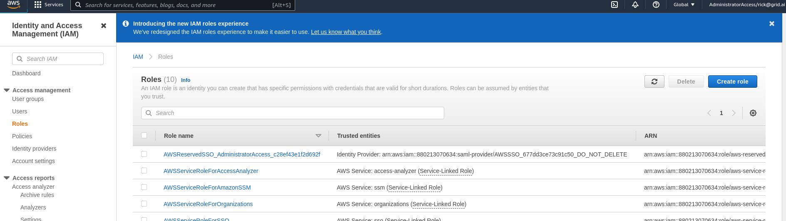

  c. Select the "custom trust policy" setting, and copy/paste the trust policy output
  from the CLI into the `json` editor:

  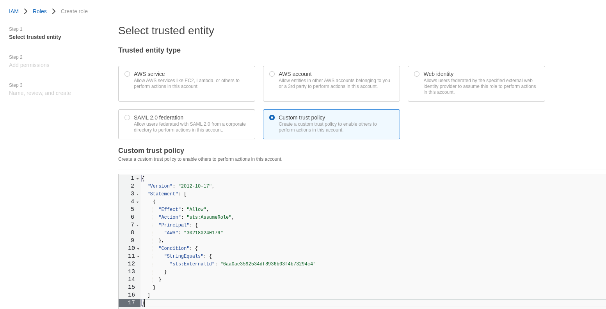

  d.  When prompted with the "add permissions to role" tab, click "Create Policy" to  create a new permission
  policy

  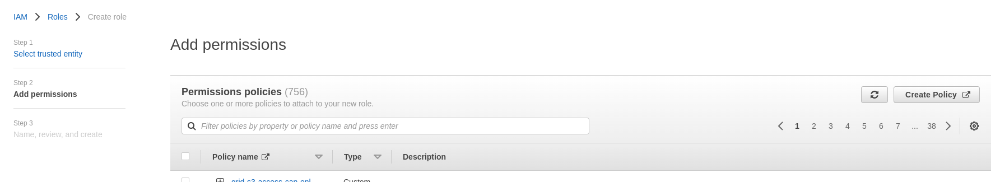

  e.  A new tab will open. Select the `json` tab, and
  copy/paste the permission policy into the editor. Also replace the text
  `<replace-with-bucket-name>` with the name of the private bucket to provide access to
  (i.e. `gridai-demo-bucket`). 

  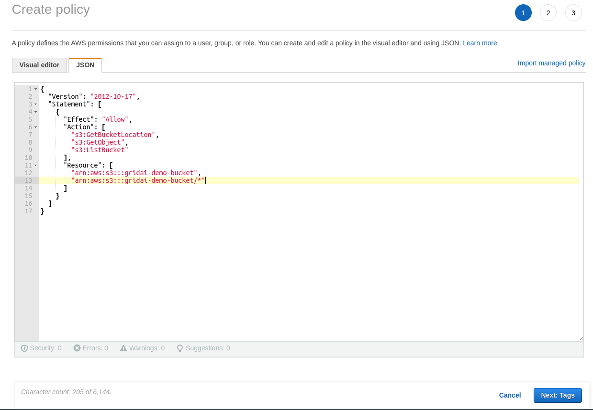

  f. Click "next" until reaching the "permission policy naming" tab. Enter an appropriate
  name, for example: `my-permission-policy-for-grid`. 

  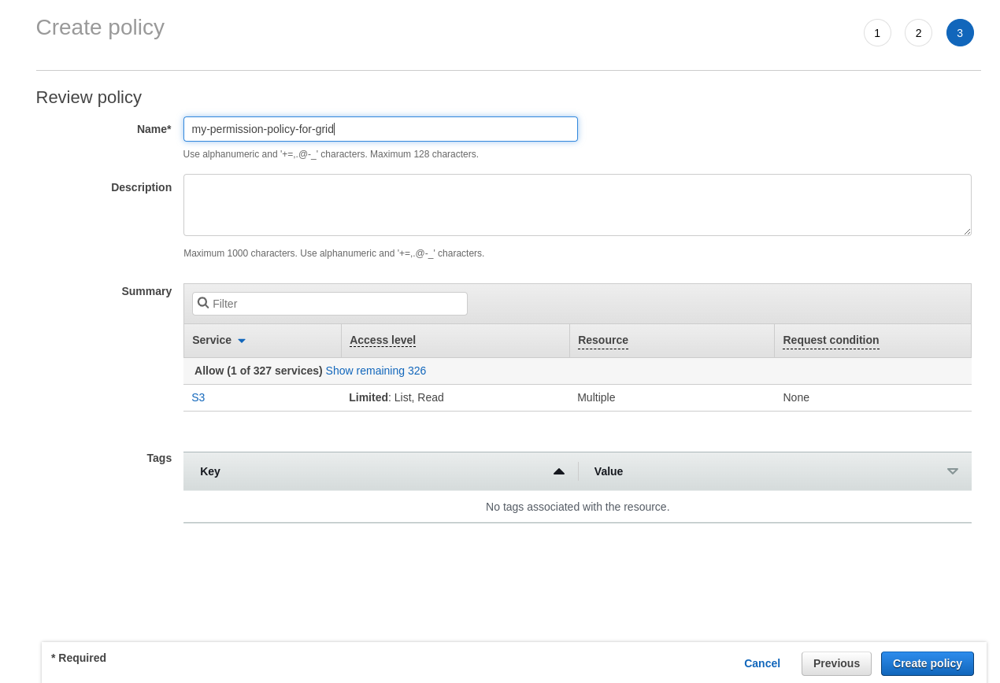

  g. Click "create policy".

  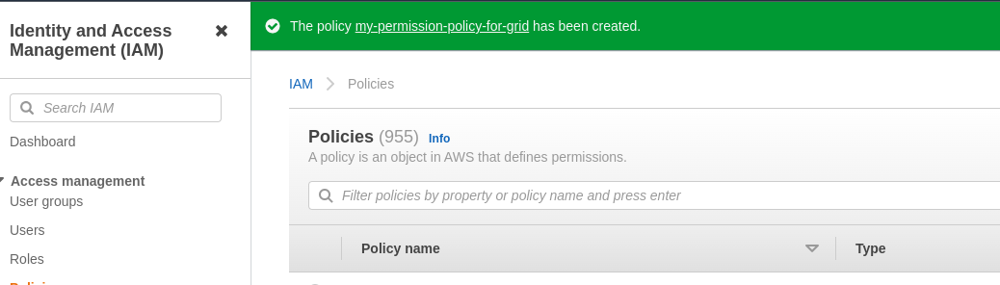

  h. Go back to the previous tab for attaching a permission policy to the role 

  i. Refresh the list of policies by clicking the refresh symbol

  j. Select the `my-permission-policy-for-grid` policy name and click "next".

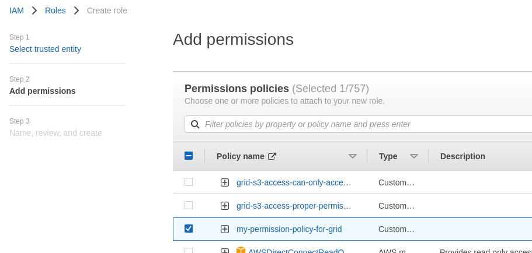

### 3. Create AWS Role Name

I then navigate through the prompts until I am presented with the "role naming" screen. At
this point, I create a role name **keeping in mind that the role must begin with the
prefix: `grid-s3-access-`**. In this case I name the role
`grid-s3-access-for-my-demo-bucket` and click create.

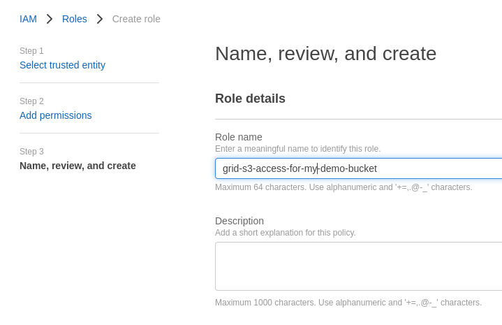


I am then presented with a success screen! The role has been created. 

### 4. Input role ARN in Grid

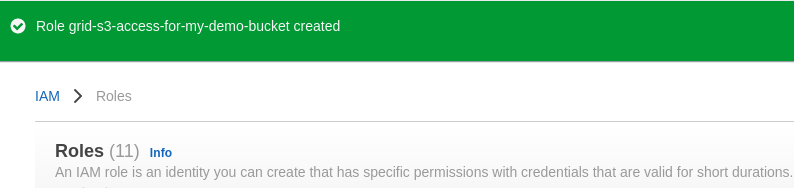

I select the role and click on the icon next to the "role ARN" in order to
copy the value to my clipboard:

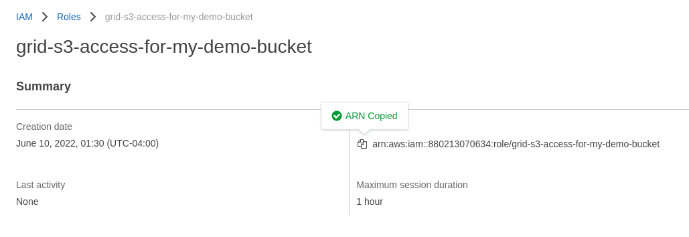

I now go back to the terminal and paste my clipboard value into the input field
I am being presented with:

```
...
...
...
When complete, please enter the role ARN: arn:aws:iam::880213070634:role/grid-s3-access-for-my-demo-bucket

Success!
```

The role has been successfully added, and I can see it in the list when I run `grid
credentials` or `grid credentials list`. 

I can now run the regular command to create a Datastore and it will
automatically pick the correct credential and create the Datastore from my private s3 bucket!

```
$ grid datastore create s3://gridai-demo-bucket/ --no-copy
Success!
```
