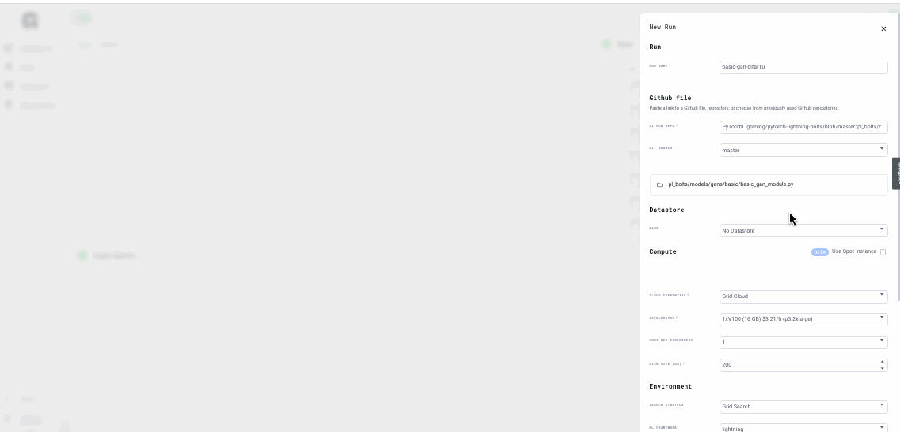

# GANs using PyTorch Lightning

## Goal

This example covers how to train a Generative Adversarial Network \(GAN\) using Pytorch Lightning; the dataset used is cifar-10 images

1. What are GANs
2. The model
3. Training
4. Visualizing results

## What are GANs?

Generative Adversarial Networks, or GANs are an approach to generative modeling using deep learning methods, such as convolutional neural networks. [https://arxiv.org/abs/1406.2661](https://arxiv.org/abs/1406.2661)

In this approach, the generative model is pitted against an adversary or discriminative model that learns to determine whether a sample image is from the model distribution or the data distribution.

## The model 

[PyTorch Lightning Bolts](https://github.com/PyTorchLightning/lightning-bolts) contains many state of the art pre-trained model recipes. For this example we will use the basic gan script to train a basic generative adversarial network; check out the code [here](https://github.com/PyTorchLightning/lightning-bolts/blob/master/pl_bolts/models/gans/basic/basic_gan_module.py). The dataset argument can train for any standard image dataset; in this example we choose cifar10

```text
from argparse import ArgumentParser

import torch
from pytorch_lightning import LightningModule, seed_everything, Trainer
from torch.nn import functional as F

from pl_bolts.models.gans.basic.components import Discriminator, Generator


class GAN(LightningModule):
    """
    Vanilla GAN implementation.
    Example::
        from pl_bolts.models.gans import GAN
        m = GAN()
        Trainer(gpus=2).fit(m)
    Example CLI::
        # mnist
        python  basic_gan_module.py --gpus 1
        # imagenet
        python  basic_gan_module.py --gpus 1 --dataset 'imagenet2012'
        --data_dir /path/to/imagenet/folder/ --meta_dir ~/path/to/meta/bin/folder
        --batch_size 256 --learning_rate 0.0001
    """
```

## Training 

Training this model using Grid, we are going to use the Web application. Login to Grid and start new Run; in the Github repo box; paste the [script](https://github.com/PyTorchLightning/pytorch-lightning-bolts/blob/master/pl_bolts/models/gans/basic/basic_gan_module.py). Choose any CPU or GPU and lightning framework. Learning rate and dataset can be specified as a script argument.



For this example, we used these values

--learning\_rate "uniform\(1e-5, 1e-1, 3\)" and --dataset "\['cifar10'\]"

Next, see the model training, generating metrics and artifacts; download as necessary

## Visualizing results

The basic gan model recipe generates metrics such as loss which can be visualized in the web interface; here you see the generator loss and discriminator loss;

```text
def generator_loss(self, x):
        # sample noise
        z = torch.randn(x.shape[0], self.hparams.latent_dim, device=self.device)
        y = torch.ones(x.size(0), 1, device=self.device)

        # generate images
        generated_imgs = self(z)

        D_output = self.discriminator(generated_imgs)

        # ground truth result (ie: all real)
        g_loss = F.binary_cross_entropy(D_output, y)

        return g_loss

    def discriminator_loss(self, x):
        # train discriminator on real
        b = x.size(0)
        x_real = x.view(b, -1)
        y_real = torch.ones(b, 1, device=self.device)

        # calculate real score
        D_output = self.discriminator(x_real)
        D_real_loss = F.binary_cross_entropy(D_output, y_real)
```



This model will train for a long time and is just an example; stop experiments at any time


